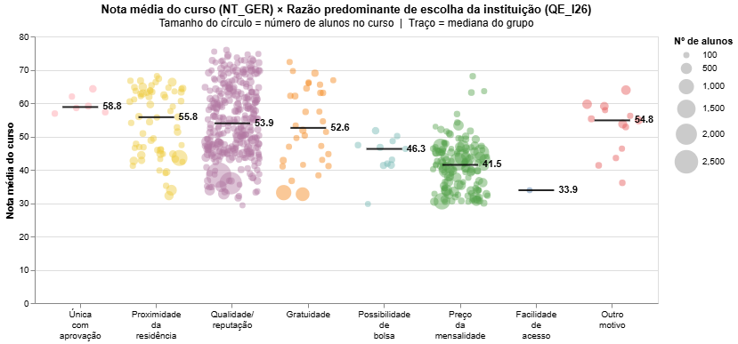

# Relatório

## Identificação

- **Nome**: Rafael Hillebrand Alexandrini
- **Cartão UFRGS:** 00587786

## Dados utilizados

1. **Dataset 1**: [Microdados do Enade 2023](https://www.gov.br/inep/pt-br/acesso-a-informacao/dados-abertos/microdados/enade)
    * **Descrição curta**: Dados do Exame Nacional de Desempenho de Estudantes feito em 2023.

## Código-fonte da visualização

- **Arquivo principal**: `analise_QE_I26_bubble.ipynb`

## Imagem da visualização gerada

## Descrição da visualização

### Legenda (*caption*)

O gráfico mostra a distribuição da nota média de cada curso (ex.: curso de Engenharia da Computação oferecida na UFRGS) no Enade 2023 em relação à razão mais comum para a escolha da instituição. Apenas cursos com mais de 100 alunos participantes do Enade são apresentados.

### Conclusão demonstrada pela visualização

Os dois principais motivos para a escolha de uma instituição (dentre as representadas, que possuem mais de 100 alunos participantes do Enade) é a Qualidade/Reputação e o Preço da Mensalidade. Embora não seja absoluto, podemos observar que instituições mais 'respeitadas' possuem uma nota média maior que as instituições procuradas pelo baixo preço.

Ainda seria preciso um trabalho estatístico para garantir a relevância dessa comparação, mas, apenas observando o gráfico, podemos afirmar que essas instituições merecem esse respeito.